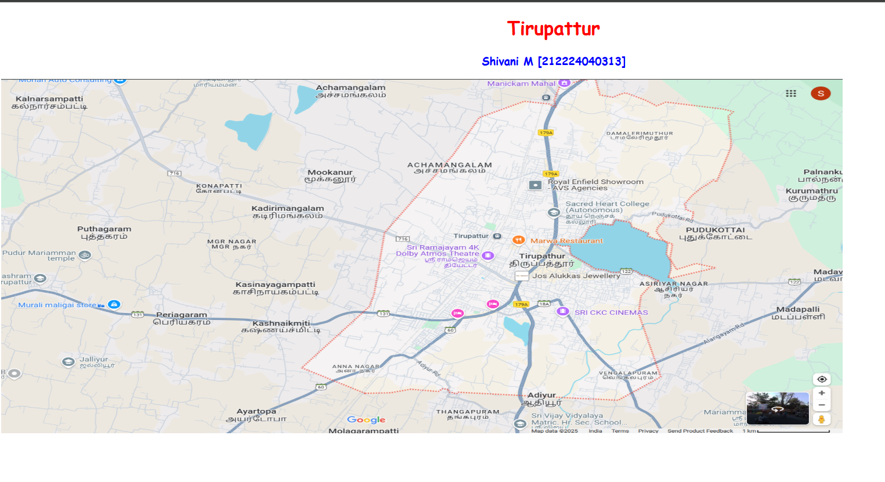
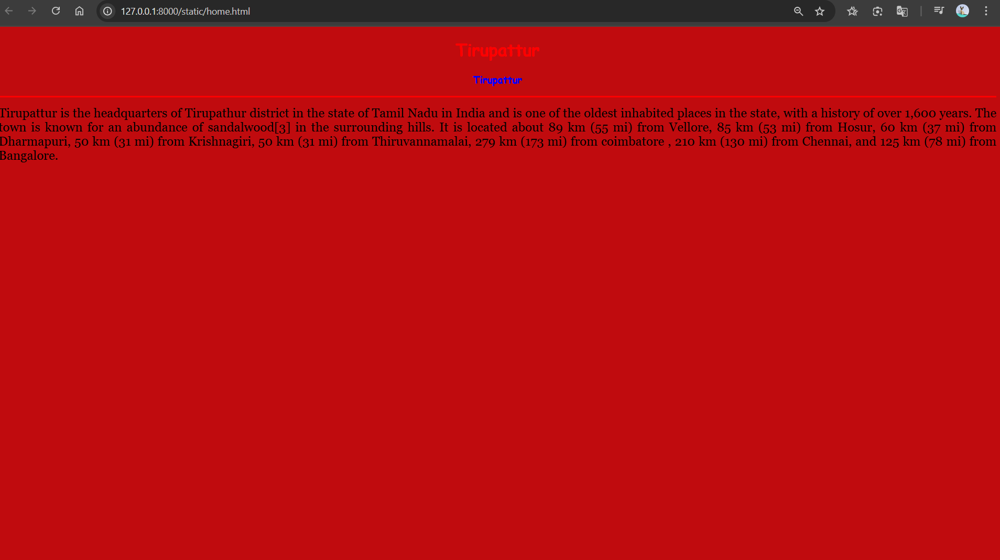
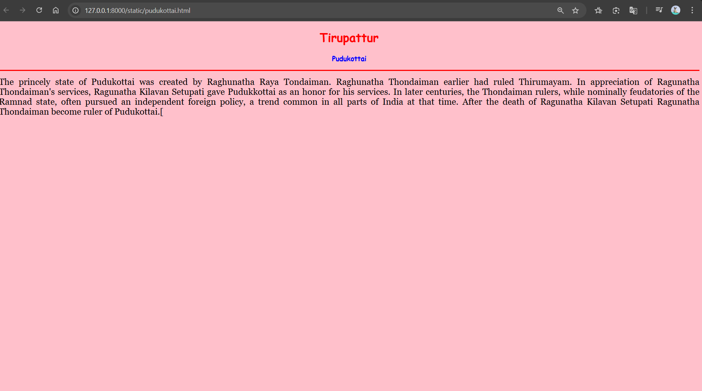
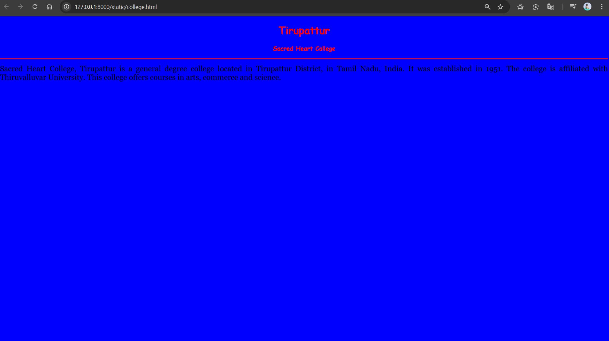
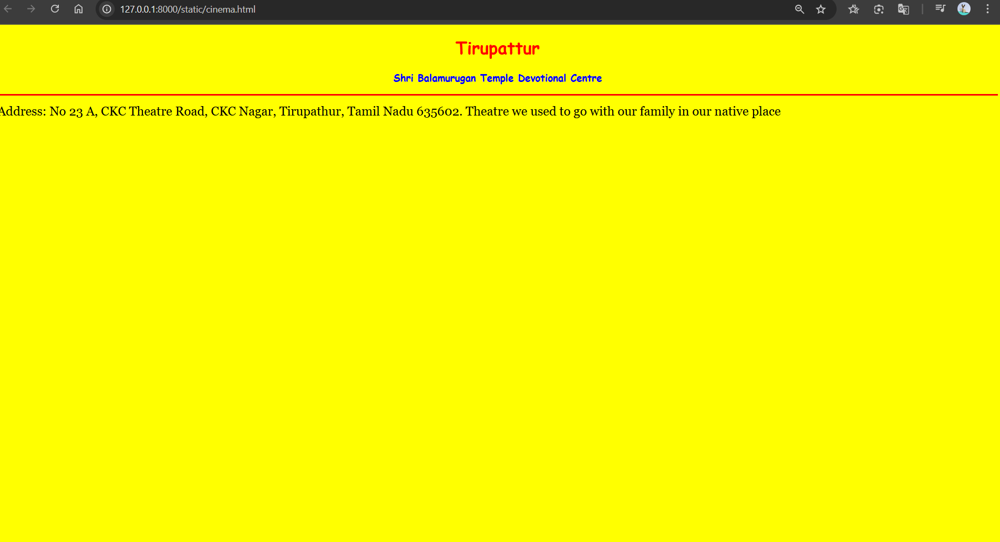

# Ex04 Places Around Me
## 212224040313
## Date: 22.04.25

## AIM
To develop a website to display details about the places around my house.

## DESIGN STEPS

### STEP 1
Create a Django admin interface.

### STEP 2
Download your city map from Google.

### STEP 3
Using ```<map>``` tag name the map.

### STEP 4
Create clickable regions in the image using ```<area>``` tag.

### STEP 5
Write HTML programs for all the regions identified.

### STEP 6
Execute the programs and publish them.

## CODE
map.html
'''
<!DOCTYPE html>
<html>
<head>
    <title>My City</title>
</head>
<body>
    <h1 align="center"><font color="red"><b>Tirupattur</b></font></h1>

    <h3 align="center"><font color="blue"><b>Shivani M [212224040313]</b></font></h3>

    

    <map name="MyCity">
            <area target="_blank" alt="Native" title="Native" href="home.html" coords="1254,599,932,482" shape="rect">
            <area target="_blank" alt="Theatre" title="Theatre" href="cinema.html" coords="1193,692,60" shape="circle">
            <area target="_blank" alt="Pudukottai" title="Pudukottai" href="pudukottai.html" coords="1436,444,97" shape="circle">
            <area target="_blank" alt="Sacred Heart college" title="Sacred Heart college" href="college.html" coords="1213,381,89" shape="circle">
        </map>
</body>
</html>

'''
home.html
```
<!DOCTYPE html>
<html>
<head>
    <title>My Home Town</title>
</head>
<body bgcolor="cyanblue">
    <h1 align="center">
        <font color="red"><b>Tirupattur</b></font>
    </h1>
    <h3 align="center">
        <font color="blue"><b>Tirupattur</b></font>
    </h3>
    <hr size="3" color="red">
    <p align="justify">
        <font face="Georgia" size="5">
         Tirupattur is the headquarters of Tirupathur district in the state of Tamil Nadu in India and is one of the oldest inhabited places in the state, with a history of over 1,600 years. The town is known for an abundance of sandalwood[3] in the surrounding hills. It is located about 89 km (55 mi) from Vellore, 85 km (53 mi) from Hosur, 60 km (37 mi) from Dharmapuri, 50 km (31 mi) from Krishnagiri, 50 km (31 mi) from Thiruvannamalai, 279 km (173 mi) from coimbatore , 210 km (130 mi) from Chennai, and 125 km (78 mi) from Bangalore.
        </font>
    </p>
</body>
</html>


```
pudukottai.html
```
<!DOCTYPE html>
<html>
<head>
    <title>My Home Town</title>
</head>
<body bgcolor="pink">
    <h1 align="center">
        <font color="red"><b>Tirupattur</b></font>
    </h1>
    <h3 align="center">
        <font color="blue"><b>Pudukottai</b></font>
    </h3>
    <hr size="3" color="red">
    <p align="justify">
        <font face="Georgia" size="5">
            The princely state of Pudukottai was created by Raghunatha Raya Tondaiman. Raghunatha Thondaiman earlier had ruled Thirumayam. In appreciation of Ragunatha Thondaiman's services, Ragunatha Kilavan Setupati gave Pudukkottai as an honor for his services. In later centuries, the Thondaiman rulers, while nominally feudatories of the Ramnad state, often pursued an independent foreign policy, a trend common in all parts of India at that time. After the death of Ragunatha Kilavan Setupati Ragunatha Thondaiman become ruler of Pudukottai.[
        </font>
    </p>
</body>
</html>

```
college.html
```
<!DOCTYPE html>
<html>
<head>
    <title>My Home Town</title>
</head>
<body bgcolor="blue">
    <h1 align="center">
        <font color="red"><b>Tirupattur</b></font>
    </h1>
    <h3 align="center">
        <font color="red"><b>Sacred Heart College</b></font>
    </h3>
    <hr size="3" color="red">
    <p align="justify">
        <font face="Georgia" size="5">
            Sacred Heart College, Tirupattur is a general degree college located in Tirupattur District, in Tamil Nadu, India. It was established in 1951. The college is affiliated with Thiruvalluvar University. This college offers courses in arts, commerce and science.
        </font>
    </p>
</body>
</html>

```
cinema.html
```
<!DOCTYPE html>
<html>
<head>
    <title>My Home Town</title>
</head>
<body bgcolor="yellow">
    <h1 align="center">
        <font color="red"><b>Tirupattur</b></font>
    </h1>
    <h3 align="center">
        <font color="blue"><b>Shri Balamurugan Temple Devotional Centre</b></font>
    </h3>
    <hr size="3" color="red">
    <p align="justify">
        <font face="Georgia" size="5">
            Address: No 23 A, CKC Theatre Road, CKC Nagar, Tirupathur, Tamil Nadu 635602.
            Theatre we used to go with our family in our native place
        </font>
    </p>
</body>
</html>

```


## OUTPUT
 
 
 
 



## RESULT
The program for implementing image maps using HTML is executed successfully.
